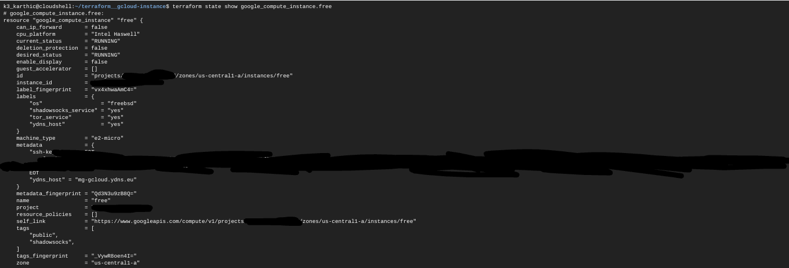
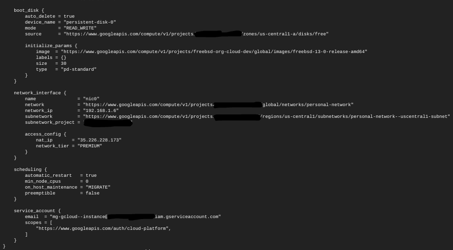

# Terraform — Deploy a single instance in Google Cloud

A [Terraform](https://www.terraform.io/) script to deploy an instance in Google Cloud running under the [Always Free](https://cloud.google.com/free) tier.

A custom VPC allows for more control over network security. The Terraform script below creates a custom VPC,
* terraform__gcloud-vpc
    * GitHub: [github.com/k3karthic/terraform__gcloud-vpc](https://github.com/k3karthic/terraform__gcloud-vpc)
    * Codeberg: [codeberg.org/k3karthic/terraform__gcloud-vpc](https://codeberg.org/k3karthic/terraform__gcloud-vpc)

The following Ansible playbook covers basic setup for FreeBSD (e.g, swap, fail2ban),
* ansible__freebsd-basic
    * GitHub: [github.com/k3karthic/ansible__freebsd-basic](https://github.com/k3karthic/ansible__freebsd-basic)
    * Codeberg: [codeberg.org/k3karthic/ansible__freebsd-basic](https://codeberg.org/k3karthic/ansible__freebsd-basic)

Use a [Njalla](https://njal.la/) hostname for the instance using the Ansible playbook below,
* ansible__gcloud-njalla-dns
    * GitHub: [github.com/k3karthic/ansible__gcloud-njalla-dns](https://github.com/k3karthic/ansible__gcloud-njalla-dns)
    * Codeberg: [codeberg.org/k3karthic/ansible__gcloud-njalla-dns](https://codeberg.org/k3karthic/ansible__gcloud-njalla-dns)

## Code Mirrors

* GitHub: [github.com/k3karthic/terraform__gcloud-instance](https://github.com/k3karthic/terraform__gcloud-instance/)
* Codeberg: [codeberg.org/k3karthic/terraform__gcloud-instance](https://codeberg.org/k3karthic/terraform__gcloud-instance/)

## Configuration

1. Create a file to store the [Terraform input variables](https://www.terraform.io/docs/language/values/variables.html). Use `uscentral.tfvars.sample` as a reference. Keep `uscentral.tfvars` as the filename or change the name in the following files,
   1. `.gitignore`
   1. `bin/plan.sh`
1. Create a custom VPC and update the subnet name in `subnetwork`. To skip creating a VPC, use `default` as the value.
1. Change `name` if you would like to change the name of the instance.
1. Set `project` to the name of your Google Cloud Project.
1. Set `zone` to an available zone in the same region as `subnetwork`. List of zones by region are at [cloud.google.com/compute/docs/regions-zones/#available](https://cloud.google.com/compute/docs/regions-zones/#available).
1. Create a hostname in Njalla and update the same in `njalla_domain` and `njalla_domain_id`.

**Note:** Image ID can be found in the release announcement from the FreeBSD website at [https://www.freebsd.org/releases/](https://www.freebsd.org/releases/).

## Authentication

[Google provider](https://registry.terraform.io/providers/hashicorp/google/latest/docs) documentation is at [registry.terraform.io/providers/hashicorp/google/latest/docs](https://registry.terraform.io/providers/hashicorp/google/latest/docs).

[Google Cloud Shell](https://cloud.google.com/shell/) can deploy this script without configuration.

## Deployment

**Step 1:** Use the following command to create a [Terraform plan](https://www.terraform.io/docs/cli/run/index.html#planning),
```
$ ./bin/plan.sh
```

To avoid fetching the latest state of resources, use the following command,
```
$ ./bin/plan.sh -refresh=false
```

**Step 2:** Review the plan using the following command,
```
$ ./bin/view.sh
```

**Step 3:** [Apply](https://www.terraform.io/docs/cli/run/index.html#applying) the plan using the following command,
```
$ ./bin/apply.sh
```

**Step 4:** Display the created instance using the following command,
```
$ terraform show google_compute_instance.free
```




## Encryption

Encrypt sensitive files (Terraform [input variables](https://www.terraform.io/docs/language/values/variables.html), SSH public key and [state](https://www.terraform.io/docs/language/state/index.html)) before saving them. `.gitignore` must contain the unencrypted file paths.

Use the following command to decrypt the files after cloning the repository,
```
$ ./bin/decrypt.sh
```

Use the following command after running `bin/apply.sh` to encrypt the updated state files,
```
$ ./bin/encrypt.sh <gpg key id>
```

